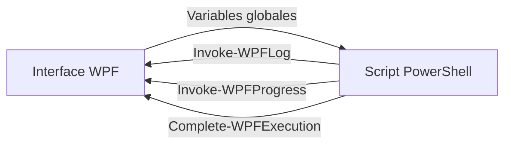

# 🖥️ Guide d'Utilisation - Interface WPF PostBoot Launcher

**Version 1.0** | Tenor Data Solutions

---

## 📋 Table des Matières

- [Vue d'ensemble](#-vue-densemble)
- [Lancement de l'interface](#-lancement-de-linterface)
- [Utilisation](#-utilisation)
- [Fonctionnalités](#-fonctionnalités)
- [Architecture Technique](#-architecture-technique)
- [Dépannage](#-dépannage)

---

## 🎯 Vue d'ensemble

Le **PostBoot Launcher** est une interface graphique WPF moderne qui permet d'exécuter les scripts PowerShell générés par PostBootSetup avec un suivi visuel en temps réel.

### Avantages

✅ **Interface intuitive** - Design moderne avec Tailwind-like styling
✅ **Suivi en temps réel** - Barre de progression 0-100% et logs colorés
✅ **Exécution asynchrone** - L'interface reste réactive pendant l'exécution
✅ **Gestion des logs** - Sauvegarde et effacement des logs
✅ **Intégration complète** - Communication bidirectionnelle avec les scripts PowerShell

---

## 🚀 Lancement de l'interface

### Méthode 1 : Raccourci Batch (Recommandé)

```batch
# Double-cliquer sur le fichier à la racine du projet
Lancer PostBoot.bat
```

**⚠️ Important :** Exécuter en tant qu'**Administrateur** (clic droit → "Exécuter en tant qu'administrateur")

### Méthode 2 : Ligne de Commande

```powershell
# Depuis le dossier PostBootSetup
powershell.exe -NoProfile -ExecutionPolicy Bypass -File "launcher\PostBootLauncher.ps1"
```

### Méthode 3 : PowerShell ISE

```powershell
# Ouvrir launcher\PostBootLauncher.ps1 dans PowerShell ISE
# Appuyer sur F5 pour exécuter
```

---

## 📖 Utilisation

### Étape 1 : Sélectionner un Script

1. Cliquer sur le bouton **📁 Parcourir**
2. Naviguer vers le dossier contenant vos scripts générés (ex: `generated/`)
3. Sélectionner le fichier `.ps1` à exécuter
4. Le chemin apparaît dans la zone "Script à exécuter"

### Étape 2 : Exécuter le Script

1. Cliquer sur le bouton **▶ Exécuter**
2. L'exécution démarre :
   - Les logs s'affichent en temps réel dans la zone centrale
   - La barre de progression se met à jour (0-100%)
   - Le statut indique l'étape en cours

### Étape 3 : Suivre l'Exécution

**Zone de logs :**
- `[ℹ]` = Information
- `[✓]` = Succès
- `[⚠]` = Avertissement
- `[✗]` = Erreur

**Barre de progression :**
- Pourcentage affiché en haut à droite
- Statut détaillé en haut à gauche
- Barre visuelle verte

### Étape 4 : Actions Post-Exécution

**Sauvegarder les logs :**
1. Cliquer sur **💾 Sauvegarder**
2. Choisir l'emplacement
3. Nom par défaut : `PostBootSetup_Log_YYYYMMDD_HHMMSS.txt`

**Effacer les logs :**
- Cliquer sur **🗑 Effacer logs**
- Réinitialise la zone de logs et la progression

**Fermer l'interface :**
- Cliquer sur **✖ Fermer**
- Confirmation demandée si un script est en cours

---

## ⚡ Fonctionnalités

### 1. Interface Graphique WPF

**Design moderne :**
- Style Tailwind CSS adapté pour WPF
- Palette de couleurs professionnelle
- Bordures arrondies et ombres
- Transitions fluides

**Composants :**
- Zone de sélection de fichier avec bouton de navigation
- Console de logs avec fond sombre (style IDE)
- Barre de progression avec pourcentage
- 5 boutons d'action

### 2. Système de Logs en Temps Réel

```powershell
# Les scripts appellent les fonctions WPF
Invoke-WPFLog -Message "Installation de Git..." -Level INFO
Invoke-WPFProgress -PercentComplete 25 -Status "Installation: Git (5/20)"
```

**Niveaux de log :**
| Niveau | Icône | Couleur | Usage |
|--------|-------|---------|-------|
| INFO | `[ℹ]` | Cyan | Informations générales |
| SUCCESS | `[✓]` | Vert | Opérations réussies |
| WARNING | `[⚠]` | Jaune | Avertissements |
| ERROR | `[✗]` | Rouge | Erreurs |

### 3. Barre de Progression

**Mise à jour automatique :**
- Calcul automatique basé sur le nombre d'applications
- Format : `Installation: Git (5/20)` → 25%
- Affichage du pourcentage en temps réel

**Statuts :**
- "Prêt à démarrer" (initial)
- "Installation: [App] (X/Y)" (en cours)
- "✓ Exécution terminée avec succès" (succès)
- "✗ Erreur lors de l'exécution" (échec)

### 4. Gestion des Logs

**Sauvegarde :**
- Format TXT avec encodage UTF-8
- Nom automatique avec timestamp
- Boîte de dialogue de sélection d'emplacement

**Effacement :**
- Réinitialise la zone de logs
- Réinitialise la progression à 0%
- Message de confirmation dans les logs

### 5. Sécurité et Validation

**Vérifications :**
- ✅ Privilèges administrateur (via le batch)
- ✅ Existence du fichier sélectionné
- ✅ Confirmation avant fermeture si exécution en cours
- ✅ Désactivation des boutons pendant l'exécution

---

## 🏗️ Architecture Technique

### Intégration WPF ↔ PowerShell



### Variables Globales WPF

Le lanceur initialise ces variables pour la communication :

```powershell
$Global:WPFLogControl     # TextBox pour les logs
$Global:WPFProgressBar    # Barre de progression
$Global:WPFStatusLabel    # Label de statut
$Global:WPFPercentLabel   # Label de pourcentage
$Global:WPFCloseButton    # Bouton de fermeture
$Global:WPFAvailable = $true  # Flag d'activation
```

### Module UIHooks.psm1

Le module `UIHooks.psm1` fournit les fonctions d'intégration :

**Fonctions disponibles :**

1. **Test-WPFAvailability**
   ```powershell
   # Vérifie si WPF est disponible
   if (Test-WPFAvailability) {
       # WPF actif
   }
   ```

2. **Invoke-WPFLog**
   ```powershell
   # Envoie un log à l'interface
   Invoke-WPFLog -Message "Installation en cours..." -Level INFO
   ```

3. **Invoke-WPFProgress**
   ```powershell
   # Met à jour la progression
   Invoke-WPFProgress -PercentComplete 50 -Status "Installation: Docker (10/20)"
   ```

4. **Complete-WPFExecution**
   ```powershell
   # Notifie la fin d'exécution
   Complete-WPFExecution -Success $true -Summary @{
       'Applications installées' = 15
       'Durée' = '05:32'
   }
   ```

### Exécution Asynchrone

Le launcher utilise un **Runspace** séparé pour exécuter le script :

```powershell
$runspace = [runspacefactory]::CreateRunspace()
$runspace.ApartmentState = "STA"
$powershell = [powershell]::Create()
$powershell.Runspace = $runspace
$asyncResult = $powershell.BeginInvoke()
```

**Avantages :**
- Interface reste réactive
- Pas de blocage de l'UI
- Annulation possible
- Logs en temps réel

---

## 🛠️ Dépannage

### Problème 1 : Erreur "Impossible de charger le fichier .ps1"

**Cause :** Politique d'exécution PowerShell restrictive

**Solution :**
```powershell
# Exécuter en tant qu'Administrateur
Set-ExecutionPolicy -ExecutionPolicy Bypass -Scope Process -Force
```

### Problème 2 : Interface ne s'affiche pas

**Cause :** Assemblies WPF non disponibles

**Solution :**
```powershell
# Vérifier la version PowerShell (5.1+ requis)
$PSVersionTable.PSVersion

# Vérifier les assemblies
Add-Type -AssemblyName PresentationFramework
```

### Problème 3 : Logs ne s'affichent pas

**Cause :** Variables globales WPF non initialisées

**Solution :**
```powershell
# Le script doit vérifier WPF avant utilisation
if ($Global:WPFAvailable) {
    Invoke-WPFLog -Message "Test" -Level INFO
} else {
    Write-Host "Test"
}
```

### Problème 4 : Barre de progression ne bouge pas

**Cause :** Appels `Invoke-WPFProgress` manquants dans le script

**Solution :**
```powershell
# Le script doit appeler régulièrement
$currentApp = 0
foreach ($app in $apps) {
    $currentApp++
    $percent = [math]::Round(($currentApp / $apps.Count) * 100)
    Invoke-WPFProgress -PercentComplete $percent -Status "Installation: $($app.name)"
}
```

### Problème 5 : Script n'attend pas la fin

**Cause :** Exécution trop rapide ou erreur

**Solution :**
- Consulter les logs d'erreur
- Vérifier que le script contient `Complete-WPFExecution`
- Ajouter des pauses : `Start-Sleep -Seconds 1`

---

## 📊 Exemple Complet

### Script PostBootSetup Optimisé pour WPF

```powershell
# Initialiser WPF
Test-WPFAvailability | Out-Null

# Démarrer
Invoke-WPFLog "========== DÉMARRAGE ==========" -Level INFO
Invoke-WPFProgress -PercentComplete 0 -Status "Initialisation..."

# Installer les applications
$apps = @("Git", "VSCode", "Docker")
$currentApp = 0

foreach ($app in $apps) {
    $currentApp++
    $percent = [math]::Round(($currentApp / $apps.Count) * 100)

    Invoke-WPFLog "Installation de $app..." -Level INFO
    Invoke-WPFProgress -PercentComplete $percent -Status "Installation: $app ($currentApp/$($apps.Count))"

    # Installation réelle
    winget install $app --silent

    if ($LASTEXITCODE -eq 0) {
        Invoke-WPFLog "✓ $app installé" -Level SUCCESS
    } else {
        Invoke-WPFLog "✗ Échec $app" -Level ERROR
    }

    Start-Sleep -Seconds 1
}

# Terminer
Complete-WPFExecution -Success $true -Summary @{
    'Applications installées' = 3
    'Durée' = '00:05:00'
}

Invoke-WPFLog "========== TERMINÉ ==========" -Level SUCCESS
```

---

## 📞 Support

**Contact :** si@tenorsolutions.com
**Documentation :** [README.md](../README.md)
**GitHub :** [PostBoot Issues](https://github.com/BluuArtiis-FR/PostBoot/issues)

---

<div align="center">

**PostBoot WPF Launcher v1.0**
Made with ❤️ by Tenor Data Solutions SI Team

© 2025 Tenor Data Solutions - Usage interne uniquement

</div>
